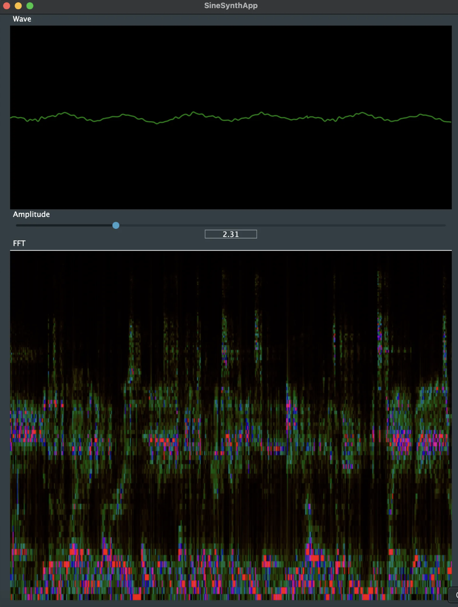

## Overview  
This application processes audio input and provides real-time visualization of:  
- **Waveform**: Displays the amplitude of the audio signal over time.  
- **Spectrogram**: Visualizes the frequency content of the audio signal dynamically.  

Designed to support learning and experimentation in audio manipulation, this application serves as a foundation for building more advanced audio processing tools.  

### Preview  
  

### Template Source  
This application template is based on the [AudioAppTemplate](https://github.com/martinstolz-ch/AudioAppTemplate).  

---  